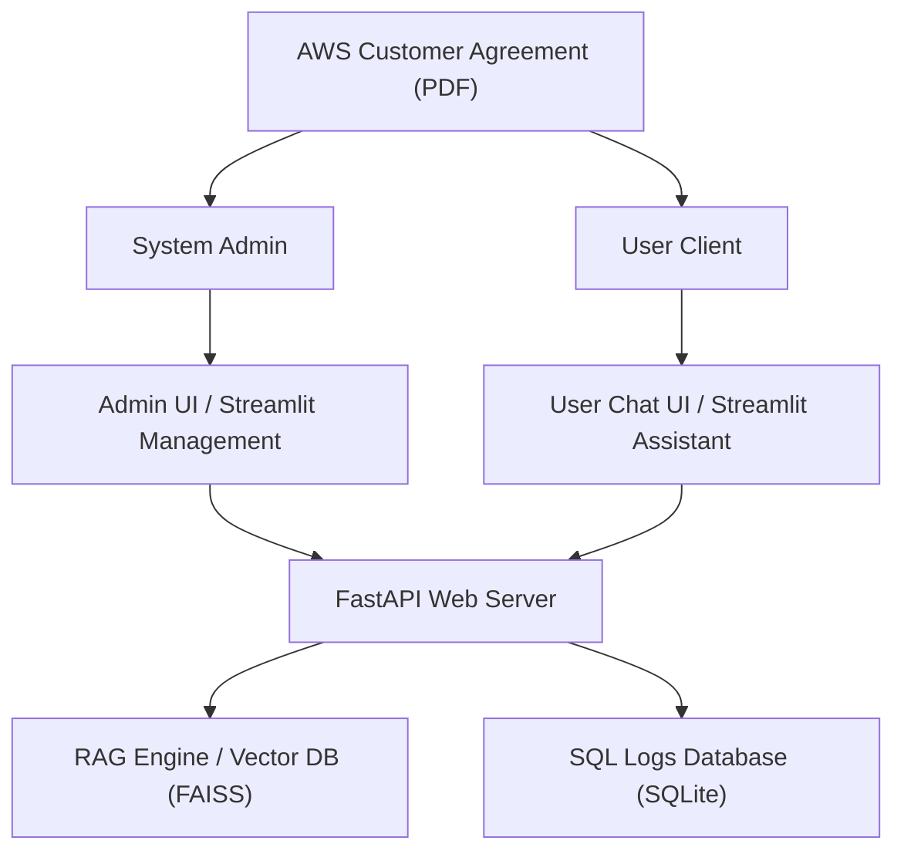

# AWS Customer Agreement Assistant

AWS Customer Agreement Assistant is a production-ready RAG (Retrieval-Augmented Generation) system designed to answer questions about the AWS Customer Agreement PDF, log usage and latency to a local SQLite database, and display detailed interactive insights via an optimized Streamlit dashboard.

---

## System Architecture

The following diagram illustrates the data flow, user roles, interface divisions, and storage endpoints:




---

## Design Justifications

### 1. Chunking Strategy (500 characters, 100 character overlap)
- **Size of 500 characters**: Corresponds to roughly 2–3 sentences. This size is granular enough to isolate specific clauses and conditions within the AWS Customer Agreement (such as liability limits, billing intervals, or account suspension parameters) without introducing irrelevant text that dilutes the embeddings.
- **Overlap of 100 characters**: Preserves context across chunk boundaries, ensuring that sentences or clauses spanning the edges of a chunk maintain semantic integrity during vector database retrieval.

### 2. Top-K Retrieve Selection (k = 4)
- **Selection of K=4**: Balances context richness against LLM inference latency. Four chunks provide sufficient reference material for the LLM to formulate highly accurate, contextual answers while keeping the input token footprint small enough to run efficiently on low-latency serverless APIs and local mock engines.

### 3. Multi-Provider LLM Orchestration
- Includes hot-swappable providers: **Ollama** (local execution), **Hugging Face Serverless Inference** (cloud execution), and a **Local Mock Fallback** (rule-based parser) to guarantee out-of-the-box operation on systems without heavy hardware requirements.

---

## Configuration & Environment Variables

Create a `.env` file in the root directory. The following settings are supported:

| Variable | Type | Default | Description |
| :--- | :--- | :--- | :--- |
| `LLM_PROVIDER` | string | `mock` | Target LLM runtime: `ollama`, `huggingface`, or `mock`. |
| `OLLAMA_MODEL` | string | `llama3.1:8b` | The model name loaded in local Ollama service. |
| `EMBEDDING_MODEL` | string | `all-MiniLM-L6-v2` | SentenceTransformer model used for embedding. |
| `TOP_K` | integer | `4` | Number of matched chunks retrieved. |
| `DATABASE_URL` | string | `sqlite:///rag_logs.db` | SQLAlchemy database URL connection string. |
| `HF_API_TOKEN` | string | `""` | Optional Hugging Face access token for API endpoint. |
| `HF_MODEL` | string | `google/gemma-2-9b-it` | The target Hugging Face model identifier. |
| `PDF_PATH` | string | `data/pdfs/aws_customer_agreement.pdf` | Local path to the agreement PDF document. |
| `VECTOR_DB_DIR` | string | `data/faiss_index` | Location on disk where FAISS index will be saved. |

---

## Setup & Startup Instructions

### 1. Install Dependencies
Run the following command to install required packages:
```bash
pip install -r requirements.txt
```

### 2. Prepare Environment variables
Copy the template configuration file:
```bash
cp .env.example .env
```

### 3. Generate PDF Agreement Source
Compile the source agreement content into a local PDF:
```bash
python -m app.utils.pdf_generator
```

### 4. Startup Commands

Start the FastAPI application server:
```bash
python -m uvicorn app.api.main:app --host 127.0.0.1 --port 8000
```

Start the Streamlit dashboard in a separate shell:
```bash
python -m streamlit run frontend/streamlit_app.py --server.port 8501
```

---

## Seeding & Performance Evaluation

Run the seeding script to automatically ingest the PDF document, trigger the embeddings engine, and execute 30 queries (20 answerable, 10 out-of-scope) to populate the SQLite logs and warm up the cache:
```bash
python seed_queries.py
```

---

## Demo Recording & Screenshots

Below is an animation demonstrating the UI flow, including the Chat interface, confidence scores, and Plotly analytics dashboard widgets:


### Analytics Dashboard Preview
Below is a screenshot of the interactive Analytics Dashboard showing real-time usage statistics and Plotly charts:


---

## API Usage Examples

### 1. Ingest PDF Document (`POST /ingest`)
```bash
curl -X POST http://127.0.0.1:8000/ingest \
     -H "Content-Type: application/json" \
     -d '{"force": true}'
```

### 2. Submit Query (`POST /ask`)
```bash
curl -X POST http://127.0.0.1:8000/ask \
     -H "Content-Type: application/json" \
     -d '{"query": "How often does AWS bill customers?"}'
```

### 3. Fetch Metrics (`GET /analytics`)
```bash
curl -X GET http://127.0.0.1:8000/analytics
```

---

## Testing & Coverage Instructions

Verify that all endpoints, exception handlers, and structured logging subsystems pass the complete test suite:
```bash
python -m pytest --cov=app tests/ -vv
```

---

## Troubleshooting Section

- **Keras 3 / TensorFlow Import Conflicts**:
  If SentenceTransformers imports fail due to protobuf compilation versions, verify that `tf-keras` is installed on your local Python environment to bypass tf-keras and native keras mismatches.
  ```bash
  pip install tf-keras protobuf==7.35.1
  ```
- **Hugging Face API Timeout**:
  If the serverless Inference API fails to load due to rate limiting or model loading delays, switch the provider to `mock` in the `.env` file to fall back to the local mock QA lookup without interruption.
- **SQLite Database Locked Error**:
  If multiple test runs lock the log database, make sure no concurrent uvicorn servers are writing to `rag_logs.db`. The test suite uses `test_rag_logs.db` dynamically to prevent production write collisions.
