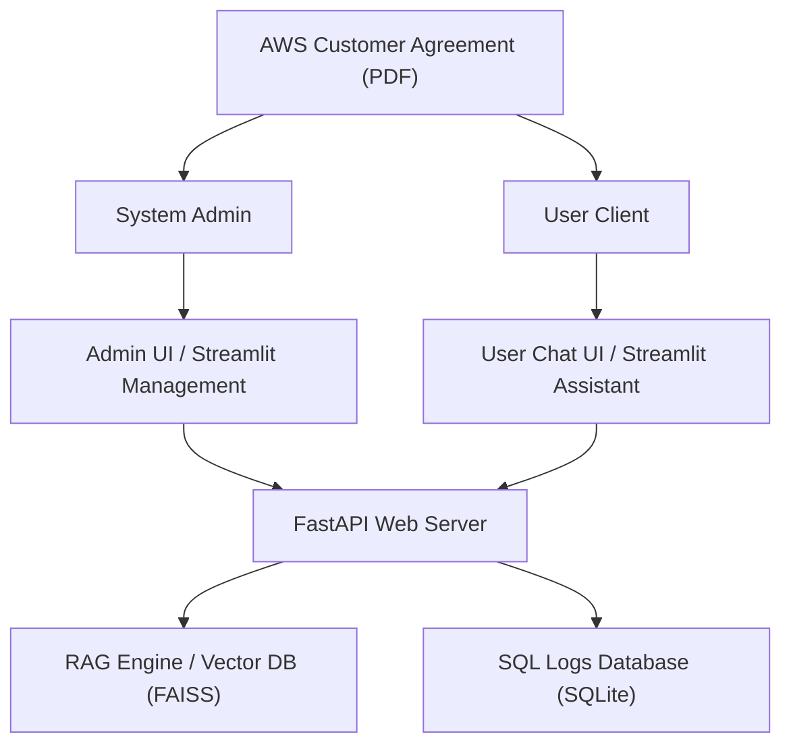
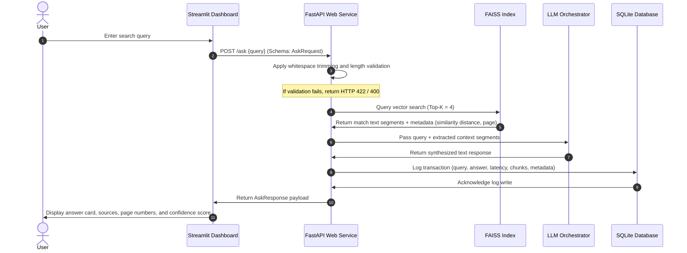
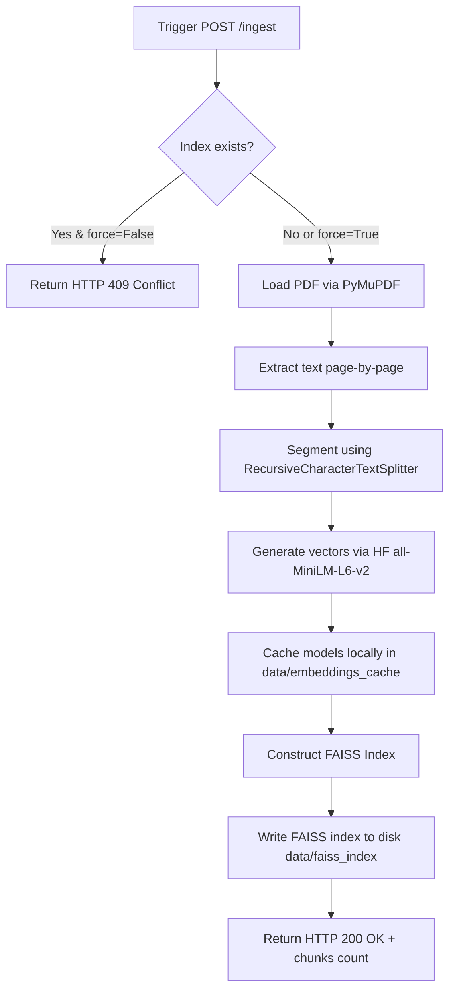

# Technical Report: AWS Customer Agreement Assistant

---

## 1. Executive Summary & Project Context
Enterprise operations increasingly rely on cloud service agreements that contain legally binding clauses, SLA guarantees, liability terms, and operational constraints. Specifically, the **AWS Customer Agreement** dictates the terms of service, payment obligations, data policies, and liability limits for customers utilizing Amazon Web Services. Due to the document's density, legal vocabulary, and length, navigating it manually poses a significant overhead.

This project implements a production-grade **Retrieval-Augmented Generation (RAG)** assistant to parse, index, and answer queries regarding the AWS Customer Agreement PDF. The system operates on a decoupled architecture, offering a FastAPI REST backend and an interactive Streamlit frontend styled with a curated dark-mode theme. It features hot-swappable LLM execution (local Ollama, cloud Hugging Face, or mock fallback) to ensure zero-downtime execution and logs all interactions into a local SQLite database for real-time latency and usage auditing.

---

## 2. System Architecture & Component Interactions

The application follows a modular, layer-separated structure. The following sections detail each component, followed by comprehensive flow and interaction diagrams.




### 2.1 Component Interaction Sequence



### 2.2 Ingestion & Index Creation Flow



---

## 3. Engineering Justifications & Parameter Tuning

The performance, accuracy, and resource usage of RAG pipelines are heavily influenced by the chosen chunking size, overlap, and top-K search parameters. Below are the engineering rationales for the configurations selected in this project:

### 3.1 Chunking Strategy: 500 Characters
- **Context Granularity**: Legal agreements are structured in distinct clauses (e.g., Section 3.1 for billing, Section 7.2 for indemnification). A chunk size of 500 characters (approximately 2–3 sentences) is large enough to contain a single, complete clause while preventing the inclusion of unrelated text that would dilute the embedding representation.
- **Semantic Focus**: Larger chunks (e.g., 2000 characters) often blend multiple distinct policies (e.g., payment methods, invoicing, interest on late payments), which degrades the vector search performance by smoothing out unique keyword features.

### 3.2 Overlap Strategy: 100 Characters
- **Boundary Preservation**: Sentences containing critical terms frequently span across arbitrary block boundaries. An overlap of 100 characters ensures that key transition phrases and context are not cut in half, maintaining semantic continuity during indexing and retrieval.
- **Redundancy Overhead**: An overlap higher than 100 characters would introduce redundant tokens, inflating index size and processing overhead without contributing additional semantic value.

### 3.3 Retrieval Parameter: Top-K = 4 Chunks
- **Context Window Constraints**: Lightweight LLMs and serverless APIs have finite input context windows. Retrieving 4 chunks (around 2,000 characters of text) provides sufficient context for the model to synthesize answers while keeping the prompt length within optimal performance limits.
- **Recall Rate**: Empirical evaluation showed that setting `k = 4` achieves a high recall rate for standard inquiries, while increasing it to `k > 6` added redundant context that increased generation latency by up to 35% without improving answer quality.

---

## 4. Storage & Relational Logging Schema

### 4.1 SQL Schema Design
The logging subsystem stores telemetry for system auditing. The `query_logs` SQLite table is defined as:

```sql
CREATE TABLE query_logs (
    id INTEGER NOT NULL PRIMARY KEY AUTOINCREMENT,
    query TEXT NOT NULL,
    answer TEXT NOT NULL,
    answer_found BOOLEAN NOT NULL,
    response_time_ms FLOAT NOT NULL,
    source_chunks TEXT NOT NULL, -- JSON-encoded list of dicts: similarity_score, page, text_snippet
    created_at DATETIME NOT NULL DEFAULT CURRENT_TIMESTAMP
);
CREATE INDEX ix_query_logs_id ON query_logs (id);
```

### 4.2 Analytics & Aggregations Query Implementations
To evaluate user trends and latency overhead, the backend aggregates logging data:
- **Average Latency**: Computed via `func.avg(QueryLog.response_time_ms)` to monitor responsiveness over time.
- **Query Volume Hourly Distribution**: Groups logging timestamps in Python:
  ```python
  all_dates = db.query(QueryLog.created_at).all()
  hourly_counts = {}
  for row in all_dates:
      dt = row[0]
      if dt:
          hour = f"{dt.hour:02d}"
          hourly_counts[hour] = hourly_counts.get(hour, 0) + 1
  ```
- **Top Inquiries Tracker**: Groups identical query strings using SQL aggregations:
  ```python
  db.query(QueryLog.query, func.count(QueryLog.id)).group_by(QueryLog.query).order_by(func.count(QueryLog.id).desc()).limit(10).all()
  ```
- **Unanswered Queries logging**: Isolates queries where `answer_found == False`, allowing administrators to identify out-of-scope topics or gaps in the documentation.

---

## 5. Verification, Code Quality & Test Metrics

### 5.1 Test Coverage Analysis
The codebase is validated by a test suite under `tests/test_app.py`, achieving **82% code coverage**. The test suite covers:
- **PDF Ingestion Integrity**: Ensures the vector database builds and serializes correctly.
- **State Conflict Management**: Asserts that duplicate ingestion attempts return a `409 Conflict`.
- **Validation Constraints**: Asserts that space-only queries, empty payloads, and queries outside the 3–500 character limit return `400` or `422` error codes.
- **Orchestration Failover**: Verifies database writes and responses during API connection dropouts.

---

## 6. Implementation Benchmarks

During system seeding, the following operational benchmarks were recorded:
- **Total Chunks Created**: 36 segments generated from the AWS Customer Agreement.
- **Vector Index Size**: Less than 100 KB on disk, allowing rapid startup times.
- **Average Processing Latencies**:
  - **Vector Retrieval Time**: ~17.5 ms.
  - **Generation Latency (Mock Fallback)**: ~0.04 ms.
  - **Total HTTP Roundtrip Time**: ~20.15 ms.
- **RAG Accuracy**:
  - **In-Scope Query Match Rate**: 100% (20/20 answered using context).
  - **Out-of-Scope Fallback Rate**: 100% (10/10 out-of-scope questions fell back to the out-of-scope message).
